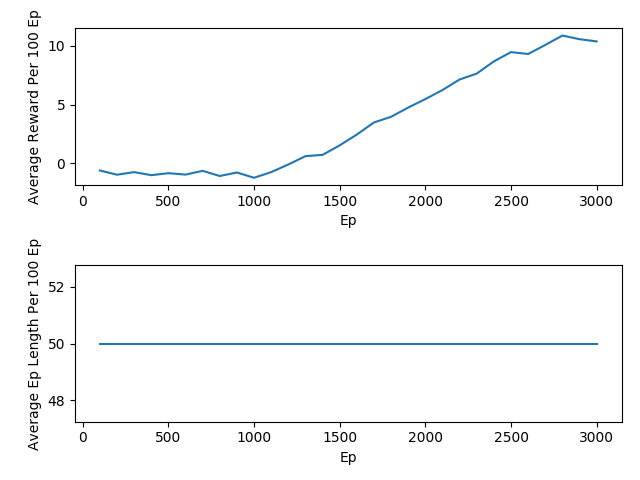

# DDDQN
## Description
Implementation of a Dueling Double Deep Q Network using TensorFlow. It also depends on Numpy and Matplotlib.

It uses three convolution layers and two layers each for the advantage and the value calculation. Two networks are used for double Q learning. The learning algorthm uses an e-greedy approach to pick the best action for each state (exploitation), with a random chance of picking a random action (exploration). The epsilon value is annealed over time.

There are two experience replay algorithms/data structures implemented. One is a simple buffer that allows previous experiences to be uniformly sampled. Another one is proportional prioritized experience replay, using a "sum tree". The sum tree is basically an embedded binary tree that allows for efficient sampling and insertion. It allows experiences that have higher errors to have a higher probability of being sampled. The sum tree shows similarities with segment trees.

The environment is a simple implementation of a grid with red (score of -1) and green (score of 1) blocks. The goal is to reach the green blocks by moving the blue character. Naturally, the four movement directions (available actions) are up, down, left, and right. I did not write the environment by myself, but I made a few edits.

I've uploaded my pretrained parameters. Here is a graph of how it performed:

And a YouTube video demostrating the result is available [here](https://www.youtube.com/watch?v=l0HVuekufnI).

I had to play around with the hyperparameters to get that result. I'm pretty satisfied, although the result is probably far from perfect. To run with the pretrained weights, make sure that the `is_testing` parameter is set to `True` in the code. Also make sure that the `load_path` is set to the correct file.

## References
[Medium post on DDDQNs](https://medium.com/@awjuliani/simple-reinforcement-learning-with-tensorflow-part-4-deep-q-networks-and-beyond-8438a3e2b8df)

[The author's code](https://github.com/awjuliani/DeepRL-Agents)

Actually, the whole series of posts helped me understand reinforcement learning. The source code is also available and it helped me learn TensorFlow. I recommend reading the posts. I used the author's implementation of the gridworld environment.

[Implementation with TensorFlow + TFLearn](https://github.com/gokhanettin/dddqn-tf)

[Deep Reinforcement Learning with Double Q-Learning](https://arxiv.org/pdf/1509.06461v3.pdf)

[Dueling Network Architectures for Deep Reinforcement Learning](https://arxiv.org/pdf/1511.06581.pdf)

[Blog post on prioritized experience replay](https://jaromiru.com/2016/11/07/lets-make-a-dqn-double-learning-and-prioritized-experience-replay/)
